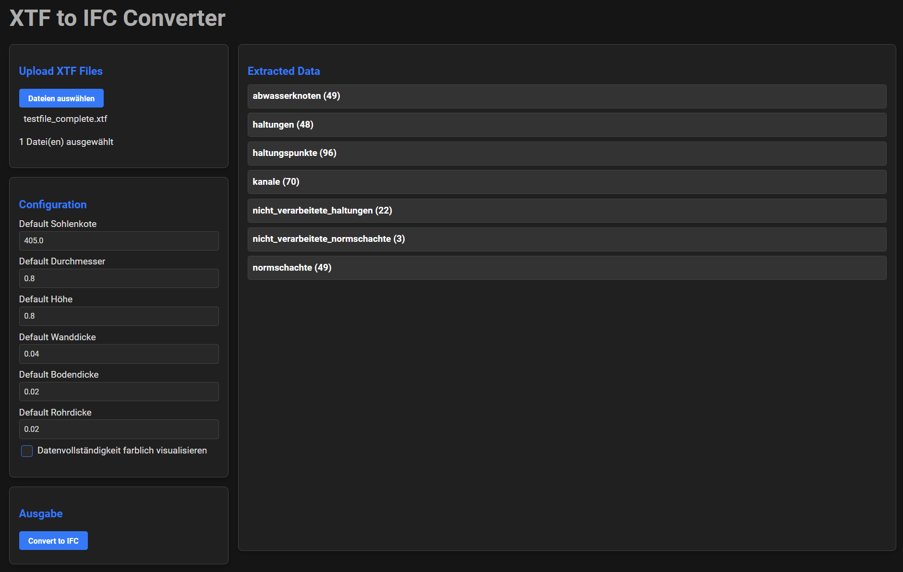

# XTF zu IFC Konverter
## Überblick
Der XTF zu IFC Konverter ist ein Python-basiertes Tool, das die Konvertierung von XTF-Dateien in IFC-Dateien ermöglicht.
### GUI
<div style="overflow: auto;">
    
</div>

<div style="clear: both;"></div>

## Funktionen
- XTF zu IFC Konvertierung: Konvertiert XTF-Dateien in IFC-Dateien.
- Konfigurationsdatei-Unterstützung: Konfiguration von Eingabe- und Ausgabepfaden über eine config.txt Datei.
- Protokollierung: Detaillierte Protokollierung zur Überwachung des Konvertierungsprozesses und zur Fehlerbehebung.
- Anpassbare Standardwerte: Definieren und Verwenden von Standardwerten für verschiedene Parameter im Konvertierungsprozess.
  

## Installation
Repository klonen:
```
git clone https://github.com/vaneeko/ili-ifc.git
cd ili-ifc
```
Erforderliche Abhängigkeiten installieren:
```
pip install ifcopenshell
pip install flask
```
## Nutzung
Starten des Tools mit Python:
```
python app.py
```
Navigieren zu: http://127.0.0.1:5000/

## Protokollierung
Protokolle werden erstellt, um detaillierte Informationen über den Konvertierungsprozess bereitzustellen. Diese Protokolle können verwendet werden, um Probleme zu identifizieren und zu beheben, die während der Konvertierung auftreten können.
